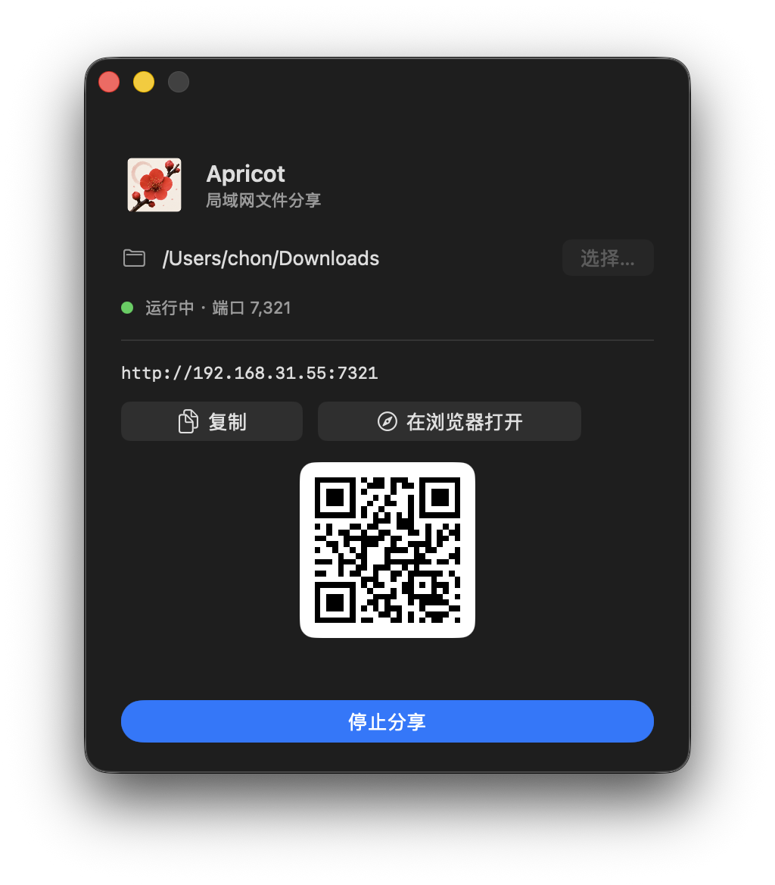

# Apricot

Share a local folder over HTTP on your LAN — from a tiny macOS menu-bar app.

Pick a folder, hit **Start Sharing**, and any device on the same network can browse and download files from a browser via the URL or QR code.

<p align="center">
  
</p>

<p align="center">
  
</p>

## Features

- **One-click LAN sharing** — serves the selected directory over HTTP.
- **Auto port fallback** — defaults to `7321`; walks up to 50 ports if busy.
- **Best LAN IP detection** — picks the most useful IPv4 address so the printed URL just works.
- **QR code** — scan from a phone to open instantly.
- **Menu-bar item** — start/stop, copy URL, open in browser, or quit without reopening the window.
- **Remembers your folder** — uses a security-scoped bookmark, sandbox-safe, persists across launches.
- **Directory indexes & range requests** — browse folders and resume large downloads.
- **Minimal UI** — 400×480 centered card, hidden title bar, apricot accent.

## Requirements

- macOS 14.6+
- Xcode (built against SwiftNIO via Swift Package Manager)

## Build & Run

The project is an Xcode project (no `Package.swift`).

```bash
# Open in Xcode and run with ⌘R
open Apricot.xcodeproj

# Or build from the command line
xcodebuild -scheme Apricot -configuration Debug build
xcodebuild -scheme Apricot -configuration Release build
```

CLI builds land in your default `DerivedData` unless you pass `-derivedDataPath`.

## How it works

| Layer | What it does |
| --- | --- |
| `ApricotApp.swift` | `@main` app + `AppDelegate` that installs the menu-bar item. |
| `AppState.swift` | `@Observable` model — folder selection, server lifecycle, security-scoped access. |
| `ContentView.swift` | SwiftUI window: folder picker, status, URL, QR, start/stop. |
| `StatusItemController.swift` | `NSStatusItem` menu + `cat.circle` icon that reflects running state. |
| `server/FileShareServer.swift` | SwiftNIO HTTP server with auto port fallback. |
| `server/HTTPFileHandler.swift` | Per-request handler: indexes, files, ranges, MIME sniffing. |
| `server/DirectoryIndex.swift` | Renders the folder listing. |
| `server/PathResolver.swift` | Maps request paths to safe filesystem locations. |
| `server/RangeParser.swift` | Parses `Range` headers for resumable downloads. |
| `server/MimeTypeMap.swift` | Best-effort `Content-Type` from extension. |
| `net/LocalNetwork.swift` | Lists interfaces and picks the best LAN IPv4. |
| `qr/QRCodeImage.swift` | CoreImage-based QR generator. |
| `storage/BookmarkStore.swift` | Persists the chosen folder across launches. |

### Sandbox & entitlements

App Sandbox is on. The app holds:

- `network.server` — listen on a port.
- `files.user-selected.read-only` — read the folder you pick.
- `files.bookmarks.app-sandbox` — remember the folder across launches.

No broader file access is requested; only the folder you explicitly choose is reachable.

## Default port

`7321`. If it's taken, Apricot tries `7322`, `7323`, … up to `7370`. The bound port shows in the UI status line and the menu-bar tooltip.

## Project layout

```
Apricot/
├── Apricot/                  # App sources (SwiftUI + AppKit + SwiftNIO)
│   ├── ApricotApp.swift
│   ├── AppState.swift
│   ├── ContentView.swift
│   ├── StatusItemController.swift
│   ├── server/               # HTTP server stack
│   ├── net/                  # LAN IP discovery
│   ├── qr/                   # QR rendering
│   └── storage/              # Bookmark persistence
├── ApricotTests/             # XCTest unit tests
└── Apricot.xcodeproj
```

## License

[MIT](LICENSE)
